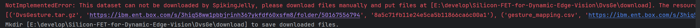

# graduate_thesis
For ResNet-LSTM model, try six_channel_main.py.

For ResNet model, try new_try_main.py.

For the download of dataset, could refer to https://ibm.ent.box.com/s/3hiq58ww1pbbjrinh367ykfdf60xsfm8/folder/50167556794. make a directory and a directory named download there.
For example, if your directory name is test, then your total path name should be "./test/download". And this is where your dataset saved. Actually, when you fail to run the codes due to 
didn't download the dataset before, you could also see a prompts like

